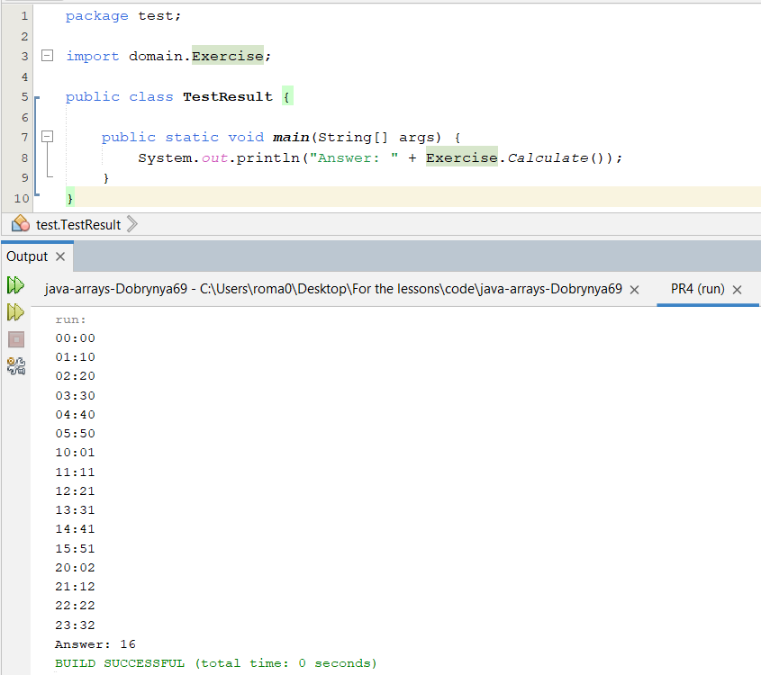

#### Електронний годинник. Підрахувати скільки разів за добу трапляється так, що зліва від двокрапки показується симетрична комбінація для тієї, що праворуч від двокрапки (02:20, 11:11 або 15:51)


#### Класс Exercise
```java
package domain;

public class Exercise {
    //Метод для додавання часу, що приймає рядок "час"
    private static String plusTime(String time){
        int timeInt = Integer.parseInt(time);
        timeInt++;
        String newTime = Integer.toString(timeInt);
        if(newTime.length() < 2){//Якщо число менше десяти, то додати нуль в початок
            newTime = "0" + newTime;
        }
        return newTime;
    }
    
    public static int Calculate(){
        String[] time = {"00", "00"};//Массив часу, містить години та хвилини
        int count = 0;//Змінна для кінцевого результату
        for (int i = 0; i < 24 * 60; i++) {//Цикл на 1440 ітерацій
            String reverseTime = Character.toString(time[1].charAt(1)) + Character.toString(time[1].charAt(0));
            if(time[0].equals(reverseTime)){//Перевірка на симетричність чисел
                System.out.println(time[0]+":"+time[1]);//Вивід для наглядності
                count++;
            }
            
            time[1] = Exercise.plusTime(time[1]);//Використання методу щбільшення часу
            if(time[1].equals("60")){//Якщо пройшло 60 хвилин, то додаємо годину
                time[1] = "00";
                time[0] = Exercise.plusTime(time[0]);
            }
        }
        return count;
    }
}

}
```
